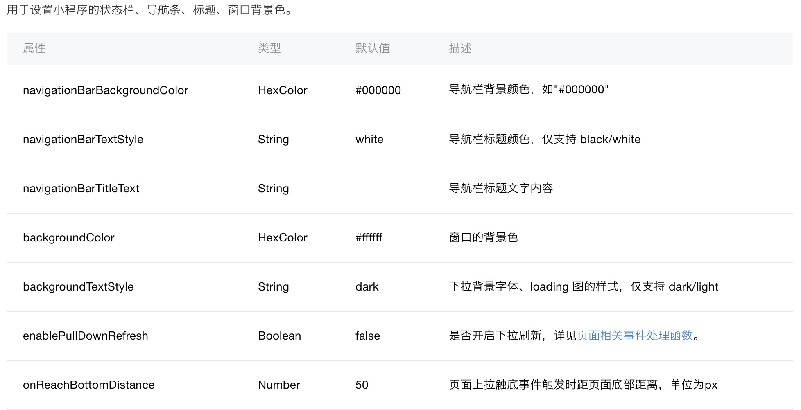
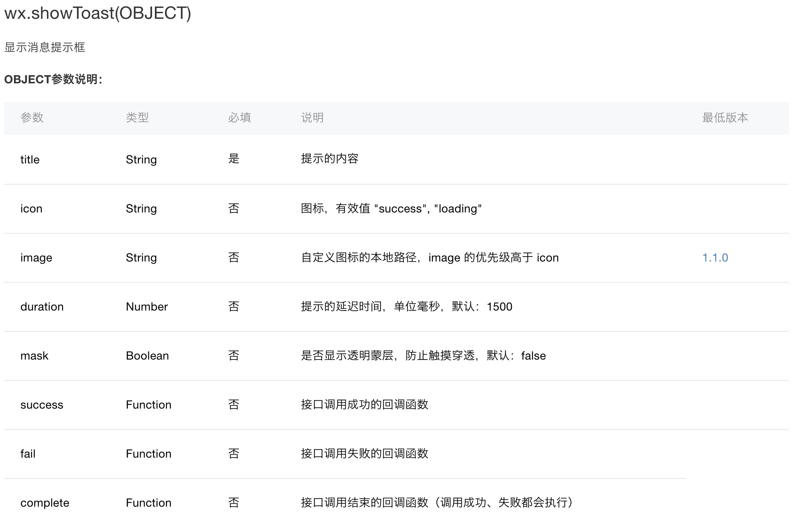

## 准备工作
- **IDE搭建**
    根据个人的操作系统，下载相应的《微信开发者工具》，[官方下载](https://mp.weixin.qq.com/debug/wxadoc/dev/devtools/download.html?t=20171227)

    

- **知识准备**
    * JavaScrip<br />
    * HTML+CSS

## 小程序开发
- **开发者工具的使用**<br />
    * 用微信扫描开发者工具二维码登录，新建项目输入appID，进入开发页面
    

- **小程序开发语言了解**<br />
    * 小程序开发中，常用的4种文件：

        * js ----------- JavaScrip文件  <br />
        * json -------- 项目配置文件，负责窗口颜色等等  <br />
        * wxml ------- 类似HTML文件  <br />
        * wxss ------- 类似CSS文件

    * 入口文件（以app来命名的文件)  <br />
      **app.json**  <br />
          必须要有这个文件，如果没有这个文件，IDE会报错，因为微信框架把这个作为配置文件入口，你只需创建这个文件，里面写个大括号就行  <br />
      以后我们会在这里对整个小程序的全局配置。记录了页面组成，配置小程序的窗口 背景色，配置导航条样式，配置默认标题。 <br />

      **app.js**  <br />
          必须要有这个文件，没有也是会报错！但是这个文件创建一下就行 什么都不需要写   <br />
      以后我们可以在这个文件中监听并处理小程序的生命周期函数、声明全局变量。

      **app.wxss**  <br />
          这个文件不是必须的。因为它只是个全局CSS样式文件

      **app.wxml**  <br />
          这个也不是必须的，而且这个并不是指主界面哦~因为小程序的主页面是靠在JSON文件中配置来决定的

      **[文件结构，以及各文件的作用](https://mp.weixin.qq.com/debug/wxadoc/dev/framework/structure.html)**

    * 实例Demo  <br />

      **创建程序实例**  [app.js官方API](https://mp.weixin.qq.com/debug/wxadoc/dev/framework/app-service/app.html)<br />
        app.js文件管理整个程序的生命周期，所以在里面添加如下代码：（输入App IDE会有提示）
        ```app.js
        App({
          onLaunch: function () {
            console.log('App Launch')
          },
          onShow: function () {
            console.log('生命周期函数--监听小程序显示')
          },
          onHide: function () {
            console.log('生命周期函数--监听小程序隐藏')
          },
          onError: function () {
            console.log('错误监听函数')
          }
        })
        ```
        

      **配置**  [app.json官方API](https://mp.weixin.qq.com/debug/wxadoc/dev/framework/config.html)<br />
        优化ActionBar(可以根据需求修改ActionBar的)
        json文件负责配置ActionBar颜色，我们只需要在里面添加如下代码即可，下图有参数说明！
        
        
        ```app.json
        {
          "window":{
            "backgroundTextStyle":"light",
            "navigationBarBackgroundColor": "#BBDEF8",
            "navigationBarTitleText": "新手入门指南",
            "navigationBarTextStyle":"white"
          }
        }```
        

      **页面构建及优化**  <br />
      美化页面我们用到了 wxml 和 wxss文件  <br />
      为了程序代码结构简洁  <br />
      我们需要在跟目录下创建一个新文件夹 名字随意，官方这里叫pages  <br />
      然后在pages文件夹里再创建新文件夹 名字随意，官方这里叫 index  <br />
      然后我们创建index.wxml文件然后在里面写入以下代码  <br />
      

      [官方.wxml](https://mp.weixin.qq.com/debug/wxadoc/dev/framework/view/wxml/)
      ```index.wxml
        <view class="container">
          Hello world!
        </view>
      ```
      [官方.wxss](https://mp.weixin.qq.com/debug/wxadoc/dev/framework/view/wxs/)
      ```index.wxss
        .container {
          font-family: bold;
          font-size: 2rem;
          color: red;
        }
      ```
      然后我们在创建的index.js里面编写我们的逻辑代码，代码如下  <br />
      ```index.js
        Page({
          data:{
            text: "点我试试！"
            // 页面的初始数据
          },
          onLoad: function(options){
            // 页面初始化 options为页面跳转所带来的参数
          },
          onReady: function(){
            // 生命周期函数--监听页面初次渲染完成
          },
          onShow: function(){
            // 生命周期函数--监听页面显示
          },
          onHide: function(){
            // 生命周期函数--监听页面隐藏
          },
          onUnload: function(){
            // 生命周期函数--监听页面卸载
          },
          onPullDownRefresh: function(){
            // 页面相关事件处理函数--监听用户下拉动作
          },
          onReachBottom: function(){
            // 页面上拉触底事件的处理函数
          },
          onShareAppMessage: function(){
            // 用户点击右上角转发
          },
          onPageScroll: function(){
            // 页面滚动触发事件的处理函数
          },
          viewTap: function() { // 其他自定义函数
            this.setData({
              text: '再点我试试'
            }, function() {
              // this is setData callback
            })
          }
        })
      ```
      每个函数的解释如下：[注册页面](https://mp.weixin.qq.com/debug/wxadoc/dev/framework/app-service/page.html)
      

      **首页路由配置**  <br />

      ?>  这时候我们要回到app.json文件里配路由了(因为我们的页面通常都不止一个，所以要配一个数组)，代码如下：
      ```app.json
        "pages":[
          "pages/index/index"
        ]
      ```
      那么配置完后我们就可以运行项目了！  <br />
      

      **事件绑定** [事件API](https://mp.weixin.qq.com/debug/wxadoc/dev/framework/view/wxml/event.html)   <br />
      
      

      下面我们绑定一个bindtap事件，在index.wxml文件绑上这个事件，同时绑上我们data初始化的数据，代码如下：
      ```index.wxml
        <view class="container">
          Hello world!
          <text class="page_data" bindtap="viewTap">{{text}}</text>
        </view>
      ```

      **更新界面数据**

      ?> 这里有个问题 我们更换完值 但是在wxml中不会立即生效
         所以我们需要调用
         this.setData()方法将值同步给wxml 让它立即生效

      ```index.js
        viewTap: function () { // 其他自定义函数
          if (flag) {
            this.setData({
              text: '再点我试试！'
            })
            flag = false;
          } else {
            this.setData({
              text: '点我试试！'
            })
            flag = true;
          }
        }
      ```
      

## 官方API
- **官方API**  <br />
    [官方API的使用](https://mp.weixin.qq.com/debug/wxadoc/dev/api/)
    

    **Toast的用法**  <br />  [showToast](https://mp.weixin.qq.com/debug/wxadoc/dev/api/api-react.html#wxshowtoastobject)

    
    ```
      示例代码：
      wx.showToast({
        title: '成功',
        icon: 'success',
        duration: 2000
      })
    ```

## 发布前准备
[小程序发布](https://mp.weixin.qq.com/debug/wxadoc/dev/quickstart/basic/role.html)
- **预览**  <br />
    使用开发工具可以预览小程序，帮助开发者检查小程序在移动客户端上的真实表现。
    点击开发者工具顶部操作栏的预览按钮，开发工具会自动打包当前项目，并上传小程序代码至微信的服务器，成功之后会在界面上显示一个二维码。使用当前小程序开发者的微信扫码即可看到小程序在手机客户端上的真实表现。

- **上传代码** <br />
    同预览不同，上传代码是用于提交体验或者审核使用的。
    点击开发者工具顶部操作栏的上传按钮，填写版本号以及项目备注，需要注意的是，这里版本号以及项目备注是为了方便管理员检查版本使用的，开发者可以根据自己的实际要求来填写这两个字段。
    上传成功之后，登录小程序管理后台 - 开发管理 - 开发版本 就可以找到刚提交上传的版本了。
    可以将这个版本设置 体验版 或者是 提交审核

- **小程序的版本**  <br />
    

## 上线  <br />
[小程序上线](https://mp.weixin.qq.com/debug/wxadoc/dev/quickstart/basic/release.html)
- **提交审核**  <br />
    为了保证小程序的质量，以及符合相关的规范，小程序的发布是需要经过审核的
    在开发者工具中上传了小程序代码之后，登录 小程序管理后台 - 开发管理 - 开发版本 找到提交上传的版本。
    在开发版本的列表中，点击 提交审核 按照页面提示，填写相关的信息，即可以将小程序提交审核。
    需要注意的是，请开发者严格测试了版本之后，再提交审核， 过多的审核不通过，可能会影响后续的时间。

- **发布**  <br />
    审核通过之后，管理员的微信中会收到小程序通过审核的通知，此时登录 小程序管理后台 - 开发管理 - 审核版本。中可以看到通过审核的版本。
    请点击发布，既可发布小程序。

- **运营数据**  <br />
    有两种方式可以方便的看到小程序的 运营数据  <br />
    方法一：登录 小程序管理后台 - 数据分析，点击相应的 tab 可以看到相关的数据。

    方法二：使用小程序数据助手，在微信中方便的查看运营数据


## Demo下载
- **案例下载**
    [示例下载址](https://github.com/Jacky-MYD/WeChat_Demo)

## 更多自定义组件示例
- **更多自定义组件**
    [组件示例下载址](https://github.com/Jacky-MYD/WeChat-assembly)
